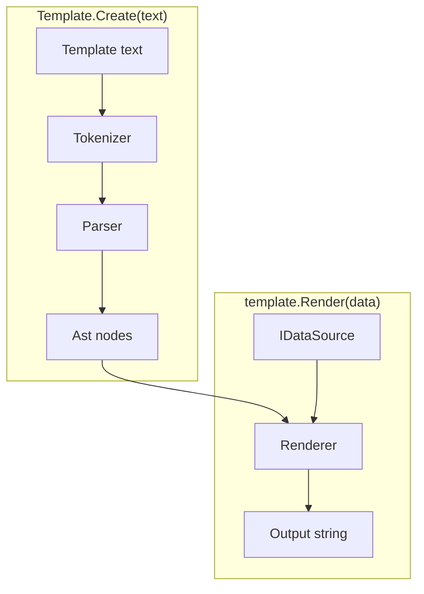
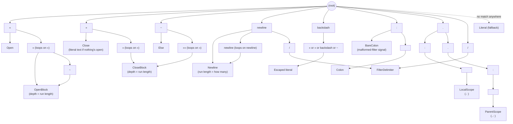
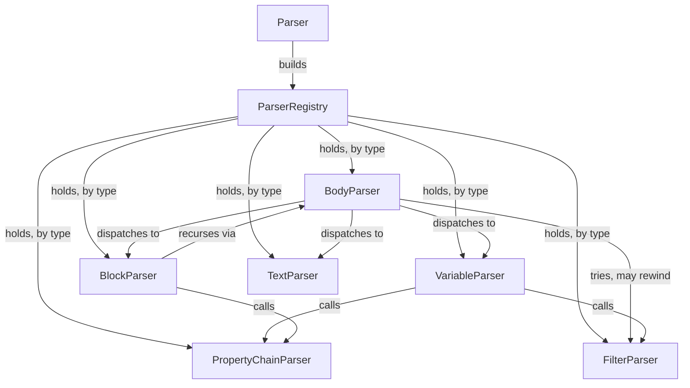

# Architecture

This describes how the engine is built, at a high level. For exact signatures
and algorithms, read the code. For behavior, see [specs.md](specs.md).

## The pipeline

A template string becomes a `Template`. A `Template` plus some data becomes
output.

`Template.Create` tokenizes and parses once. What comes back is a parsed tree
with nothing render-specific in it. `template.Render(data)` walks that tree
against some data and produces a string. Call it as often as you like, with
different data each time. The `Template` itself never changes.

The rest of this document follows that pipeline, one namespace at a time:
`Tokenization` → `Parsing` → `Ast` → `Rendering`. `Data` and `Filters` come
last; they are the two extension points `Rendering` calls out to.

## Tokenization

Turns raw text into a flat list of tokens. It has no idea what any of it means.
That is every later stage's job.

`SymbolTree` is a trie. Each character walks one level deeper, and a node with a
`TokenKind` attached is a match. Longest match wins. Depth (`«`, `««`, `«««`,
...) and the two scope-navigation markers (`.: `, `..: `) therefore cost nothing
extra — they share prefixes with shorter symbols.

Symbols are declared once, in `Symbols.cs`. A new symbol or repeating run is one
line there and nothing else in the tokenizer changes. `Tokenizer` only asks the
tree how far a match extends and moves past it. Anything the tree doesn't
recognize piles up as plain text.

Every kind shares one `Token` shape — a `readonly record struct` holding a
`TokenKind`, an offset and length into the template string, and a `Position`.
There is no type hierarchy. `Text` slices the source off that offset only when
asked, so a kind nobody reads `.Text` from never allocates a string.

> [!NOTE]
>
> Every kind except `Open` and `OpenBlock` reports `IsText: true`. Each one can
> therefore fall back to plain literal text when its special meaning doesn't
> apply: a stray `»`, a bare `:` with no space, `.: ` in prose, a `»»` or `~`
> that doesn't sit alone on its line. The tokenizer never has to understand
> context to get this right.

One `Newline` token covers a whole run of consecutive newlines, so `Parsing` can
take only the newlines a construct is owed and leave the author's own alone.

`Token` answers questions about its own surroundings by reading the characters
either side of its slice, which is why no parser ever reaches into the template
string. The rules that act on those answers, and throw, live in
`TokenExtensions` next door rather than on `Token` itself.

## Parsing

Recursive-descent, one small class per kind of node.

`ParserRegistry` has no opinion on what a "parser" is. Each class exposes
whatever shape fits it, instead of being forced through one common interface.
Collaborators that need each other are wired lazily, so registration order is
never a hazard.

`PropertyChainParser` owns the scope-navigation syntax (`.: ` and `..: `), which
it parses up front, before the rest of a chain. `FilterParser` is a small
grammar layered on top of a chain or a block's footer.

> [!NOTE]
>
> Nothing marks a block-footer line. `join: , »»` looks like body text right up
> to its last two characters. So `BodyParser` guesses: at the start of every
> line inside a block it asks `FilterParser` for a pipeline, then rewinds
> (`TokenCursor.Rewind`) unless that pipeline parses *and* lands glued to the
> closing `»»` with nothing between. That is the spec's "MUST be the only thing
> on that line" rule. Anything else is ordinary body text.

### Whitespace

Whitespace rules are enforced and consumed across three layers, split by what
each one can know: `Token` answers questions about the characters beside a
marker, `BlockParser` consumes the newlines the syntax owns, and `BlockNode`
settles what depends on data. `Template.Render` then trims a trailing run of
newlines back to one — the only place output whitespace is touched after
parsing. What the rules themselves are lives in [specs.md](specs.md).

## Ast

The parsed tree. Plain data, with no behavior beyond rendering dispatch.

Most node types implement `IRenderable`, the one interface `Renderer` walks:
`LiteralNode` for plain text, `VariableNode` for an inline `«...»`, and
`BlockNode` for a `««...»»`. Each holds what it needs to render itself — a
property chain, a nested body of child `IRenderable`s, a filter pipeline.

A few node types are data only and never render themselves. `PropertyChainNode`
is a resolved property chain with its navigation and negation flags.
`FilterNode` is one pipeline stage. `TableBody` is a loop body already cut into
heading, repeating row and footer, built once by the `BlockNode` that owns it.
`Rendering` resolves or applies these rather than calling `Render` on them.

## Rendering

Walks the `Ast` against a `Scope` and produces the output string. A `Scope` is
the current data plus a link to its parent, which is what makes property
fallback and loop-relative magic variables work.

`BlockNode` resolves its header to one of three behaviors, all implementing
`IBlockBehavior`:

| Resolved type | Behavior              |
|---------------|-----------------------|
| list          | `LoopBehavior`        |
| object        | `ScopeBehavior`       |
| anything else | `ConditionalBehavior` |

Same syntax every time. Only the resolved type decides.

A loop body whose lines all start and end with `|` renders as a markdown table
rather than a plain repeat. The heading, divider and footer are split out from
the one row that actually repeats.

`BlockNode` applies the block's footer filter pipeline, if there is one, the
same way for all three behaviors. That is why `join` and `join last` are no-ops
on a conditional or scope block: there is only ever one item to act on.

### Property resolution

`PropertyResolver` is a thin per-render façade. `PropertyChainResolution` does
the work, walking a `Scope` chain for one property chain at a time.

Two behaviors apply everywhere a chain resolves, not only in a block header:

- A chain whose last segment is a boolean property projected through a list
  (`items: active`) filters the list down to the matching item(s), instead of
  collapsing to a list of booleans.
- A chain that flattens through two list levels (`quotes: prices`) merges into
  one combined list, rather than one list *per* quote.

For a single-segment chain, magic `first` and `last` resolve before anything
else. That is what lets them shadow an item's own same-named property.

Scope navigation layers on top. `.: ` skips both that shadowing and
enclosing-scope fallback, looking only at the current scope's own data. `..: `
climbs the `Scope` parent chain first.

> [!NOTE]
>
> Climbing past the outermost scope isn't an error. It resolves to nothing, the
> same as any other chain that can't find its property. Scope navigation
> therefore never needs to know the template's real nesting depth at parse time.

### Name resolution

`Rendering.Glossary` turns one property-chain segment (`quote no`) into the
model's real property name (`OfferNo`). It wraps whatever `IStringLocalizer` the
caller set on `ParseOptions.Localizer`.

Both the lookup and its fallback route through one function,
`ParseOptions.PropertyNameConversion`. It converts a matched glossary entry's
`Name` into a property name. For a segment the glossary doesn't cover — or when
there is no glossary at all — it converts the segment itself. It defaults to
`TextCasing.Dehumanize()`. A caller can replace it outright, but not compose
with it, to target a model that isn't PascalCase or camelCase.

`Glossary.GetOrCreate` caches built glossaries. The outer store is a
`ConditionalWeakTable` keyed by the `IStringLocalizer` instance; each entry is a
small `ConcurrentDictionary` keyed by `(culture, propertyNameConversion,
collisionResolver)`. Two templates sharing a localizer, culture and conversion
function reuse one built `Glossary`.

The weak table matters for lifetime. A scoped or transient localizer — the
common ASP.NET Core case — can still be collected once nothing else holds it,
instead of pinning every glossary ever built. A `null` localizer skips the cache
and builds a fresh `Glossary`, which is cheap.

> [!IMPORTANT]
>
> The cache key uses `CultureInfo.CurrentUICulture`, not `CurrentCulture`. That
> is the culture `IStringLocalizer`'s own resource resolution varies by. Keying
> on the wrong one would let a cache hit serve a `Glossary` built for a stale UI
> culture.

## Data

Adapts external data formats behind one small interface, so the rest of the
engine never touches a concrete format.

`IDataSource` is the one interface `Rendering` talks to for external data. It
covers object/array/scalar shape, property lookup, boolean coercion and the
display string.

JSON, POCO and Newtonsoft `JToken` are the three built-in adapters. All three
ship in the one core package rather than as separate per-format packages. Anyone
can add another by implementing the same interface.

## Filters

The pluggable value-transform pipeline stages behind `«expr / filter: arg»` and
the block-footer join.

`IFilter` is the one interface behind a pipeline stage: a sequence-in,
sequence-out transform. `Template.Create`'s optional `Action<ParseOptions>`
callback exposes `ParseOptions.Filters`, for registering your own alongside the
built-ins, and `ParseOptions.Localizer`. Both configure in one place.

A bare filter stage — no `: value` at all — can mean different things depending
on where it is written. `join` defaults to `, ` inline, but to a newline in a
block footer. `IFilter.GetDefaultArg(FilterContext)` is a default interface
method for this. Most filters leave it alone and stay context-free; `JoinFilter`
overrides it.

## Tests

The `/specs` fixture corpus is the main acceptance suite. `SpecTests` runs it
once, against JSON data. Every other data-source adapter gets a smaller,
targeted suite instead of re-running the whole corpus.
