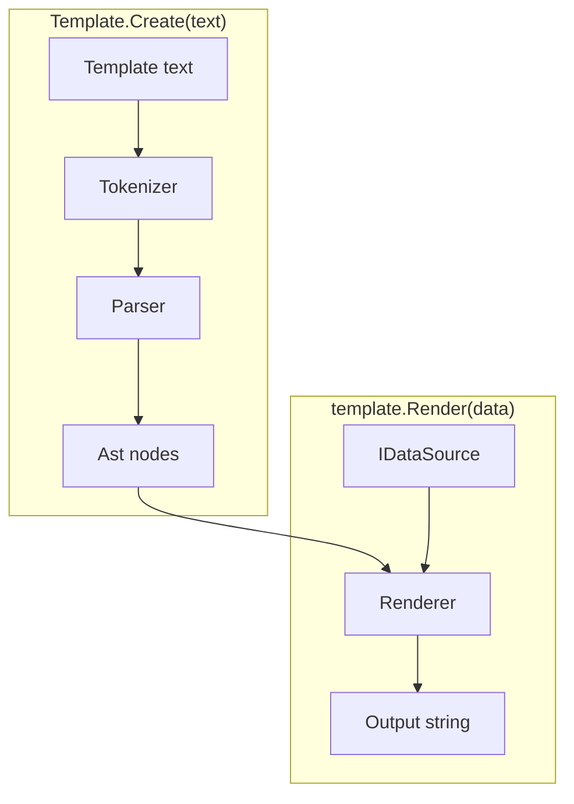
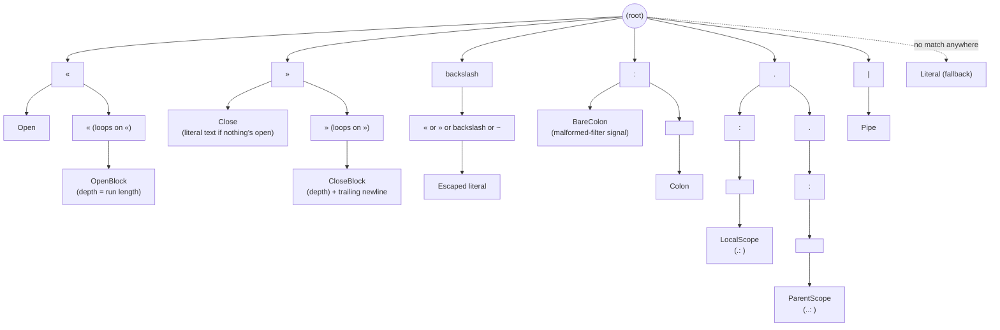
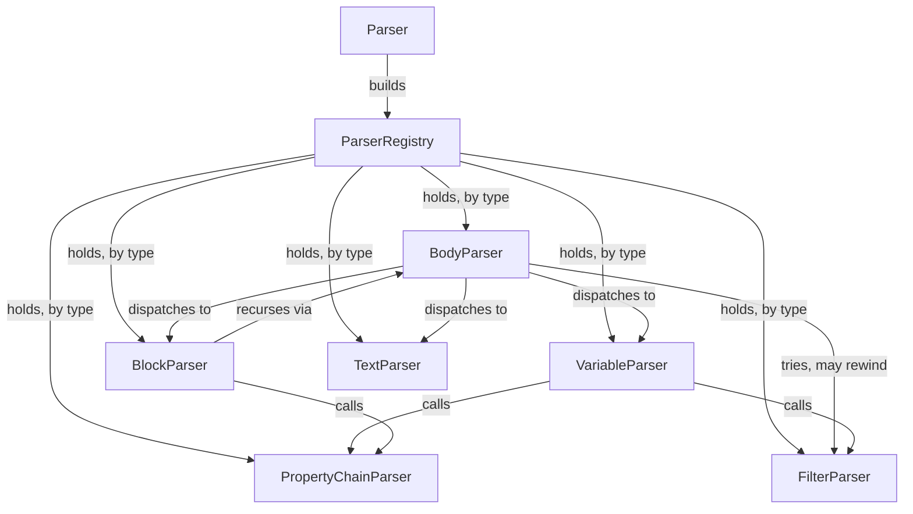

# Architecture

This describes how the engine is built, at a high level. For exact
signatures and algorithms, read the code. For behavior, see
[specs.md](specs.md).

## The pipeline

A template string becomes a `Template`. A `Template` plus some data
becomes output.

`Template.Create` tokenizes and parses once, giving back a parsed tree
with nothing render-specific in it. `template.Render(data)` walks that
tree against some data and produces a string — call it as many times as
you like, with different data each time; the `Template` itself never
changes.

## Namespaces

- **`Tokenization`** turns raw text into a flat list of tokens, driven by
  a trie of the engine's fixed symbols and multi-character runs. It has
  no idea what any of it means.
- **`Parsing`** is recursive-descent, one small class per kind of node,
  wired together through a small type-keyed registry rather than a DI
  framework.
- **`Ast`** holds the parsed tree: plain data, mostly `IRenderable` nodes
  plus a couple of pure data records that never render on their own.
- **`Rendering`** walks the `Ast` against a `Scope` (the current data plus
  a link to its parent, for property fallback and loop-relative magic
  variables) and produces the output string. Property lookup — including
  scope fallback and the "filtered items" loop case — lives here too.
- **`Data`** adapts external data formats (JSON, POCO, Newtonsoft) behind
  one small interface, so the rest of the engine never touches a concrete
  format.
- **`Filters`** are the pluggable value-transform pipeline stages behind
  `«expr | filter: arg»` and the block-footer join.

## Tokenization, in more detail

`SymbolTree` is a trie: each character read from the template walks one
level deeper, and reaching a node that has a token factory attached is a
match. Longest match wins, so `«` vs. `««` vs. `«««` (block depth) falls
out for free — a `«`-node just loops back to itself, one extra depth per
repeat, instead of needing separate cases per nesting level.

Symbols are declared once, in `Symbols.cs`, as named constants fed into a
fluent tree-builder (`.Add(path, tokenFactory)`, plus a `repeat` flag for
self-looping runs like `«`/`»`, and a `newline` flag for tokens — `»»`,
`~` — that also swallow their own trailing line break into the same
token). Adding a new fixed symbol or multi-character run is one line
there; nothing else in the tokenizer changes.

`Tokenizer` itself doesn't know what any of this means — it just asks the
tree how far the next match extends, character by character, and moves
its cursor past it. Anything the tree doesn't recognize accumulates as
plain text and becomes a `LiteralToken` once a real match (or the end of
the template) flushes it.

`\«`, `\»`, `\~`, and `\\` resolve to an `EscapedToken` instead of a
plain `LiteralToken` — same `Text`, but a distinct type. `EscapedToken`
inherits `LiteralToken`, so every other parser that pattern-matches on
`LiteralToken` still sees it. Only `FilterParser` cares about the
difference: inside a filter value, an *unescaped* `\n`/`\t`/`\|` means
"literal newline/tab/pipe," but a global escape already resolved to one
of those characters must not be reinterpreted a second time. The
distinct type is what lets it tell the two apart.

A bare `:` (no trailing space) matches `BareColonToken` instead of
falling into `LiteralToken`. `FilterParser` uses it to catch a botched
filter invocation (`join:oops` instead of `join: oops`) right where a
*registered* filter name is immediately followed by one — not a
general tokenizer rule, which would misfire on ordinary prose like
`Time: 10:30am`.

`LocalScopeToken` (`.: `) and `ParentScopeToken` (`..: `) follow the
same shape as `ColonToken`: both implement `ITextToken`, so `.: `/`..: `
appearing in ordinary prose (outside a property chain, or without the
trailing space) round-trips as plain literal text — nothing about the
tokenizer itself knows these are scope-navigation markers. That meaning
is applied entirely in `PropertyChainParser` (below).

A lone `»` that never closes anything — nothing's open, or it's a run
whose length doesn't match a real close — still needs to render as
plain text. `CloseToken` implements `ITextToken` for exactly that: the
same fallback that already renders `ColonToken`/`NewlineToken`/etc. as
literal text when nothing more specific claims them handles a stray
`»` too.

## Parsing, in more detail

`ParserRegistry` has no opinion on what a "parser" is — each class exposes
whatever shape actually fits it, rather than all being forced through one
common interface. `BodyParser` is the one place that switches on a
token's type to pick a handler; everything else either gets dispatched to
by it, or is a plain collaborator fetched by type. Collaborators that need
each other are wired lazily, so registration order never becomes a
hazard.

`BodyParser` also owns block-footer detection. There's no lead token that
marks a footer line — `join: , »»` looks, up to its last two characters,
like it could just be body text. So at the start of every line inside a
block, `BodyParser` speculatively asks `FilterParser` to parse a filter
pipeline from that position. Three outcomes all mean "not a footer, keep
going": the pipeline fails to parse (unknown filter name — ordinary body
text almost never doubles as one), it parses but isn't immediately
followed by the block's closing `»»` (there's more body content on the
line), or a newline shows up before `»»` does. `TokenCursor.Rewind` puts
the cursor back in all three cases and normal body parsing continues
untouched. That last case is enforced inside `FilterParser` itself, not
just checked afterward: parsing in footer mode stops dead at a newline
instead of crossing it, unlike parsing an inline `«…»` token, which may
legitimately span several lines. Only when the pipeline parses *and*
lands exactly on `»»`, glued to it with nothing between — matching the
spec's "MUST be the only thing on that line" rule — does `BodyParser`
commit to it as the block's footer instead of a body node.

`PropertyChainParser.ParseLeadingNavigator` runs once, before the main
segment-parsing loop starts (and would need to run again after an `=`
in a variable definition, if a future fixture needs `.: `/`..: ` there
too — nothing currently exercises that). It consumes zero or more
`ParentScopeToken`s (each one increments `PropertyChainNode.ClimbLevels`)
followed by at most one `LocalScopeToken` (sets `ThisScopeOnly`); a
`LocalScopeToken` or `ParentScopeToken` found immediately after that is
a parse error — `.: ` must be the last navigator before the chain
itself.

## Rendering behavior

`BlockNode` resolves its header to one of three behaviors, all
implementing `IBlockBehavior`:

| Resolved type | Behavior              |
| ---            | ---                   |
| list           | `LoopBehavior`        |
| object         | `ScopeBehavior`       |
| anything else  | `ConditionalBehavior` |

Same syntax every time; only the resolved type decides. A loop body
that starts and ends each line with `|` renders as a markdown table
instead of a plain repeat, with a heading/divider/footer split out
from the one row that actually repeats.

`IBlockBehavior.Render` returns one string per rendered item —
`Conditional`/`Scope` return zero or one, `Loop` returns one per item
(or a single already-merged string for a table, since its
heading/rows/footer can't be pulled apart again afterward). `BlockNode`
applies the block's own footer filter pipeline, if any, to whatever
comes back — uniformly, regardless of which behavior produced it —
then joins the result into the block's final rendered string. That
uniform handling is why `join`/`join last` are natural no-ops on a
`Conditional`/`Scope` block: there's only ever one item for them to
act on.

### Loop items, filtering, and flattening

`PropertyResolver` is a thin per-render façade — it just constructs a
`PropertyChainResolution` (one `scope`/`properties` pair, plus the
render's `VariableStore`/`Glossary`) for each chain it's asked to
resolve, and delegates. `PropertyChainResolution.Resolve` is where a
loop's items actually get found, and it applies two rules a plain
property chain doesn't need:

- If the chain's last segment is a boolean property projected through
  a list (`items: active`), the list filters down to the matching
  item(s) instead of collapsing to a list of booleans — every matched
  item's value is checked for `DataKind.Boolean` first, so this only
  kicks in for a genuine boolean field, not e.g. a number that happens
  to read as falsy/truthy.
- A chain that flattens through two list levels (`quotes: prices`,
  each quote holding its own list of prices) merges into one combined
  list, rather than one list *per* quote.

Both rules apply everywhere a chain resolves, not just in a block
header — used inline, they still filter/flatten the same way; there's
just no body to scope into, so each surviving item's own display
representation is what renders.

`Scope.TryGetMagic` resolves `first`/`last` before anything else is
even considered, for a single-segment chain — that's what makes them
shadow an item's own same-named property, and why they're always the
*innermost* loop's position from inside a nested loop: `IsFirst`/
`IsLast` are set directly on each loop-item `Scope`, so they never
fall back to a parent scope the way an ordinary property lookup would.

### Scope Navigation

`PropertyChainNode` carries two navigation flags a plain chain doesn't
need: `ThisScopeOnly` (set by a leading `.: `) and `ClimbLevels` (one
per leading `..: `). `ClimbLevels` is read in exactly one place,
`ClimbedScope`; `ThisScopeOnly` is deliberately checked independently by
each of `TryMagic`/`TryDefinedVariable`/`TryFilteredItemScope`/`Owner`
instead of once by their shared caller, so `Resolve` itself never
touches either flag directly — each helper stays a self-contained
answer to "does this particular lookup apply here," rather than
`Resolve` collecting the flags up front and threading a precomputed
answer through every branch.

- `ClimbedScope` walks `Scope.Climb(ClimbLevels)` — a small recursive
  method on `Scope` itself, the same shape as `FindOwner`. Climbing
  past the outermost scope (`Parent` running out before the walk
  completes) returns `null`, not an error.
- `Owner` (used for the final `Project` fallback) and every `TryXxx`
  guard check `ClimbedScope` first: `null` short-circuits the whole
  chain to unresolved, the same as a chain through a missing property
  — climbing too far isn't a special case anywhere downstream, it's
  just another way to end up with nothing to resolve against.
  `ThisScopeOnly` then decides, at whichever scope the climb landed on,
  whether magic-var shadowing, a defined variable, and enclosing-scope
  fallback are still consulted (`..: name`, climb then normal rules) or
  skipped entirely in favor of that scope's own data only
  (`..: .: name`, climb then pin).

`PropertyChainParser.ParseLeadingNavigator` (see Parsing, above) is the
only place either flag gets set — `Resolve` and its `TryXxx` helpers
only ever *read* them.

### Name Resolution

`Rendering.Glossary` turns one property-chain segment (`quote no`) into
the model's actual property name (`OfferNo`). It wraps whatever
`IStringLocalizer` the caller set on `ParseOptions.Glossary` — a plain
`IStringLocalizer?` field on `Template` until `Render` asks
`Glossary.GetOrCreate(localizer)` for one, then hands that same
instance to both `PropertyResolver` and the render's root `Scope`.

`Glossary.GetOrCreate` caches by `(localizer,
CultureInfo.CurrentUICulture.Name)` in a single process-wide
`ConcurrentDictionary` — global, not per `Template`, so any two
templates sharing the same `IStringLocalizer` reuse the same built
`Glossary` for a given culture instead of each rebuilding their own.
Keyed on `CurrentUICulture` specifically (not `CurrentCulture`) because
that's the culture `IStringLocalizer`'s own resource resolution actually
varies by — keying on the wrong one would let a cache hit silently serve
a `Glossary` built for a stale UI culture.

`PropertyChainResolution.Project` indexes it directly (`_glossary[segment]`),
once per chain segment. `Scope` carries its own `Glossary` too, since
`Scope.FindOwner` needs to test whether an *ancestor* scope owns a given
property. Every child `Scope` inherits its parent's `Glossary` unless one
is passed explicitly, so only the root `Scope` built in `Template.Render`
needs to supply it.

Resolution itself: look the segment up against the underlying
`IStringLocalizer`'s entries (matching a `LocalizedString.Value`,
case-insensitively) and use the matching entry's `Name`; fall back to
Humanizer's `.Dehumanize()` when there's no glossary, or no matching
entry.

## Pluggable data sources & filters

`IDataSource` is the one interface the engine talks to for external
data — object/array/scalar shape, property lookup, boolean coercion,
display string. JSON, POCO, and Newtonsoft `JToken` are the three
built-in adapters, all shipped in the one package; anyone can add
another.

`IFilter` is the one interface behind `«expr | filter: arg»` — a
sequence-in, sequence-out pipeline stage. `Template.Create`'s optional
`Action<ParseOptions>` callback exposes `ParseOptions.Filters`, so callers
can register their own alongside the built-ins (see `README.md`'s Custom
filters section) — the same callback also exposes `ParseOptions.Glossary`,
so both concerns configure through one place instead of separate
overloads.

A bare filter stage (no `: value` at all) can mean something different
depending on where it's written — `join`'s default is `, ` inline but
a newline in a block footer. `IFilter.GetDefaultArg(FilterContext)` is
a default interface method for this: most filters don't override it
and stay context-free, `JoinFilter` does. `FilterNode.Apply(values,
context)` is what actually applies it — an explicit `: value` always
wins, and only a bare stage falls through to `GetDefaultArg`.
`VariableNode` (inline) and `BlockNode.ApplyFooter` (block footer)
each call it with their own `FilterContext`, so a bare `join` reads
correctly in either spot.

`BlockNode.ApplyFooter` runs the footer pipeline once, uniformly,
regardless of which `IBlockBehavior` produced the items — a loop's
per-iteration renders, or a conditional/scope's single one. Each item
is trimmed of its own trailing newline first, so `join`'s separator
doesn't collide with one already baked into the render; pipeline
stages then run in sequence narrowing the list, and the survivors are
rejoined with a trailing newline each. A loop with no footer at all
still reads as one item per line, same as before footers existed —
that's just what an empty pipeline leaves in place.

## Tests

The `/specs` fixture corpus is the main acceptance suite, run once
through `SpecTests` against JSON data. Each other data-source adapter
gets a smaller, targeted test suite instead of re-running the whole
corpus.
