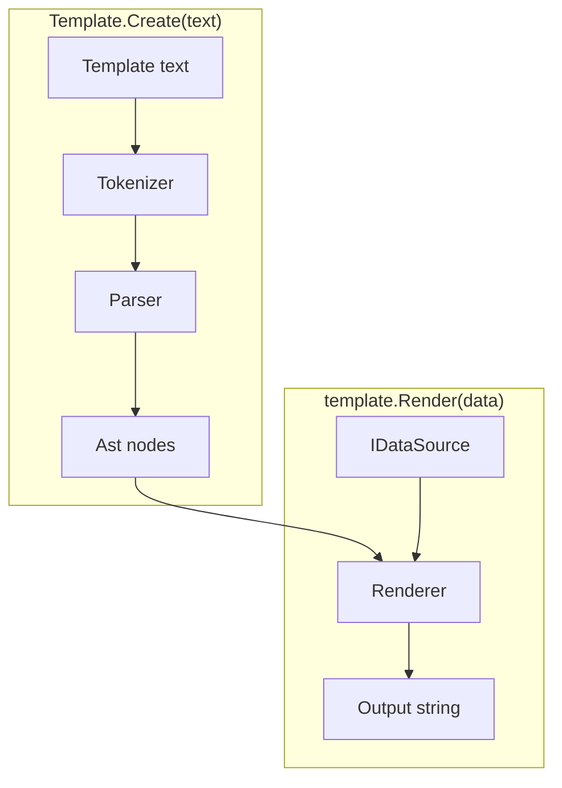
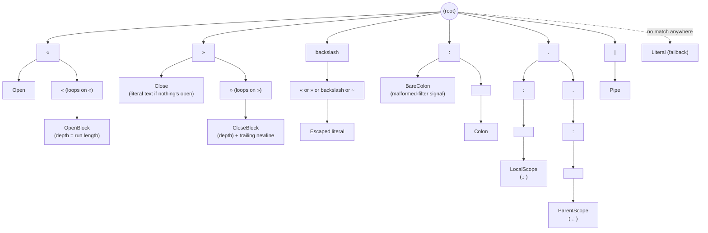
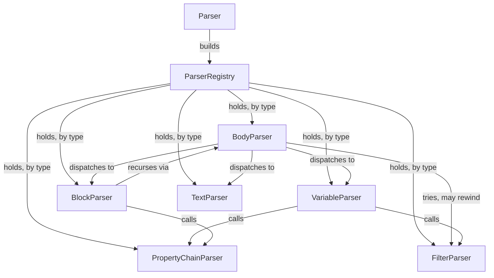

# Architecture

This describes how the engine is built, at a high level. For exact signatures
and algorithms, read the code. For behavior, see [specs.md](specs.md).

## The pipeline

A template string becomes a `Template`. A `Template` plus some data becomes
output.

`Template.Create` tokenizes and parses once, giving back a parsed tree with
nothing render-specific in it. `template.Render(data)` walks that tree against
some data and produces a string — call it as many times as you like, with
different data each time; the `Template` itself never changes.

The rest of this document follows that same pipeline, one namespace at a time:
`Tokenization` → `Parsing` → `Ast` → `Rendering`, plus `Data` and `Filters`, the
two pluggable extension points `Rendering` calls out to.

## Tokenization

Turns raw text into a flat list of tokens. It has no idea what any of it means —
that's every later stage's job, not this one's.

`SymbolTree` is a trie: each character read from the template walks one level
deeper, and reaching a node that has a token factory attached is a match.
Longest match wins, so depth (`«`, `««`, `«««`, ...) and the two
scope-navigation markers (`.: `, `..: `) fall out for free from shared prefixes,
instead of needing separate cases per case.

Symbols are declared once, in `Symbols.cs`. Adding a new fixed symbol or
multi-character run is one line there; nothing else in the tokenizer changes.
`Tokenizer` itself just asks the tree how far a match extends and moves its
cursor past it — anything the tree doesn't recognize accumulates as plain text.

> [!NOTE]
>
> Several distinct token types — `ColonToken`, `BareColonToken`, `CloseToken`,
> `LocalScopeToken`, `ParentScopeToken` — all implement `ITextToken`. That's
> what lets each one fall back to rendering as ordinary literal text whenever it
> shows up somewhere its special meaning doesn't apply (a stray `»`, a bare `:`
> with no space, `.: ` in prose outside a property chain), without the tokenizer
> itself needing to understand context.

## Parsing

Recursive-descent, one small class per kind of node.

`ParserRegistry` has no opinion on what a "parser" is — each class exposes
whatever shape actually fits it, rather than all being forced through one common
interface. Collaborators that need each other are wired lazily, so registration
order never becomes a hazard. `PropertyChainParser` owns scope-navigation syntax
(`.: `/`..: `), parsed once up front before the rest of a chain, and
`FilterParser` is a small grammar layered on top of a chain or a block's footer.

> [!NOTE]
>
> There's no lead token marking a block-footer line — `join: , »»` looks like it
> could just be body text up to its last two characters. `BodyParser` resolves
> this by speculatively asking `FilterParser` to parse a filter pipeline at the
> start of every line inside a block, then rewinding (`TokenCursor.Rewind`) if
> it doesn't parse *and* land glued to the closing `»»` with nothing between —
> matching the spec's "MUST be the only thing on that line" rule. Anything else
> is treated as ordinary body text.

## Ast

The parsed tree: plain data, no behavior beyond rendering dispatch. Most node
types implement `IRenderable`, the single interface `Renderer` walks —
`LiteralNode` (plain text), `VariableNode` (an inline `«...»`), `BlockNode` (a
`««...»»`) — each holding whatever it needs to render itself: a property chain,
a nested body of child `IRenderable`s, an optional filter pipeline.

A couple of node types exist purely as data and never render themselves:
`PropertyChainNode` (a resolved property chain, plus its navigation and negation
flags) and `FilterNode` (one pipeline stage). These get handed to `Rendering` to
be resolved or applied, rather than answering `IRenderable.Render` on their own.

## Rendering

Walks the `Ast` against a `Scope` — the current data plus a link to its parent,
for property fallback and loop-relative magic variables — and produces the
output string.

`BlockNode` resolves its header to one of three behaviors, all implementing
`IBlockBehavior`:

| Resolved type  | Behavior              |
| ---            | ---                   |
| list           | `LoopBehavior`        |
| object         | `ScopeBehavior`       |
| anything else  | `ConditionalBehavior` |

Same syntax every time; only the resolved type decides. A loop body that starts
and ends each line with `|` renders as a markdown table instead of a plain
repeat, with a heading/divider/footer split out from the one row that actually
repeats.

`BlockNode` applies the block's own footer filter pipeline, if any, uniformly
across all three behaviors, which is why `join`/`join last` are natural no-ops
on a `Conditional`/`Scope` block — there's only ever one item for them to act
on.

### Property resolution

`PropertyResolver` is a thin per-render façade over `PropertyChainResolution`,
which does the actual work of walking a `Scope` chain for one property chain at
a time. Two behaviors apply everywhere a chain resolves, not just in a block
header:

- A chain whose last segment is a boolean property projected through a
  list (`items: active`) filters the list down to the matching item(s), instead
  of collapsing to a list of booleans.
- A chain that flattens through two list levels (`quotes: prices`)
  merges into one combined list, rather than one list *per* quote.

Magic `first`/`last` resolve before anything else for a single-segment chain,
which is what lets them shadow an item's own same-named property. Scope
navigation (`.: `/`..: `) layers on top: `.: ` skips that shadowing and
enclosing-scope fallback in favor of the current scope's own data only, and `..:
` climbs the `Scope` parent chain first.

> [!NOTE]
>
> Climbing past the outermost scope isn't an error — it's treated the same as
> any other chain that can't find its property, resolving to nothing rather than
> throwing. Scope navigation never needs to know the template's actual nesting
> depth at parse time because of this.

### Name resolution

`Rendering.Glossary` turns one property-chain segment (`quote no`) into the
model's actual property name (`OfferNo`), wrapping whatever `IStringLocalizer`
the caller set on `ParseOptions.Localizer`. Both that lookup and its fallback
route through one function, `ParseOptions.PropertyNameConversion` — it
converts a matched glossary entry's `Name` into a property name, and, for any
segment the glossary doesn't cover (or when there's no glossary at all), the
segment itself. It defaults to `TextCasing.Dehumanize()`; a caller can replace
it outright (not compose with it) to target a model whose properties aren't
PascalCase/camelCase.

`Glossary.GetOrCreate` caches built glossaries in a single process-wide
`ConcurrentDictionary`, keyed by `(localizer, culture, propertyNameConversion)`,
so two templates sharing the same `IStringLocalizer`, culture, and conversion
function reuse the same built `Glossary`.

> [!IMPORTANT]
>
> The cache key uses `CultureInfo.CurrentUICulture`, not `CurrentCulture` —
> that's the culture `IStringLocalizer`'s own resource resolution actually
> varies by. Keying on the wrong one would let a cache hit silently serve a
> `Glossary` built for a stale UI culture.

## Data

Adapts external data formats behind one small interface, so the rest of the
engine never touches a concrete format.

`IDataSource` is the one interface `Rendering` talks to for external data —
object/array/scalar shape, property lookup, boolean coercion, display string.
JSON, POCO, and Newtonsoft `JToken` are the three built-in adapters, all shipped
in the one core package rather than as separate per-format packages; anyone can
add another by implementing the same interface.

## Filters

The pluggable value-transform pipeline stages behind `«expr | filter: arg»` and
the block-footer join.

`IFilter` is the one interface behind a pipeline stage — a sequence-in,
sequence-out transform. `Template.Create`'s optional `Action<ParseOptions>`
callback exposes both `ParseOptions.Filters` (register your own alongside the
built-ins) and `ParseOptions.Localizer`, so both concerns configure through one
place.

A bare filter stage (no `: value` at all) can mean something different depending
on where it's written — `join`'s default is `, ` inline but a newline in a block
footer. `IFilter.GetDefaultArg(FilterContext)` is a default interface method for
this; most filters don't override it and stay context-free, `JoinFilter` does.

## Tests

The `/specs` fixture corpus is the main acceptance suite, run once through
`SpecTests` against JSON data. Each other data-source adapter gets a smaller,
targeted test suite instead of re-running the whole corpus.
