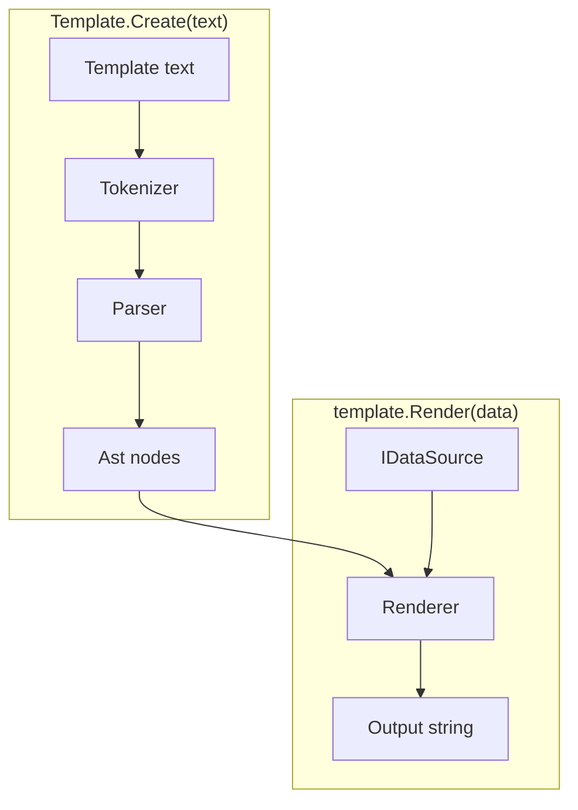
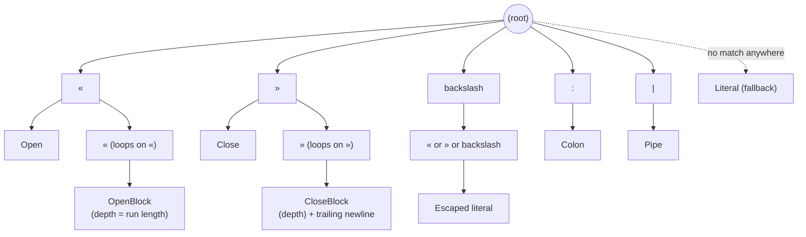
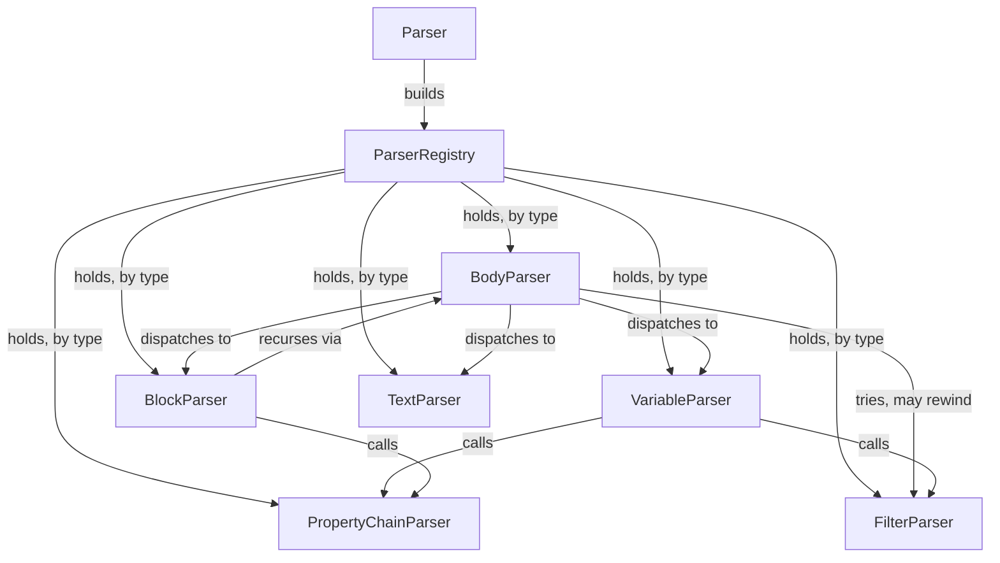

# Architecture

This describes how the engine is built, at a high level. For exact
signatures and algorithms, read the code. For behavior, see
[specs.md](specs.md).

## The pipeline

A template string becomes a `Template`. A `Template` plus some data
becomes output.

`Template.Create` tokenizes and parses once, giving back a parsed tree
with nothing render-specific in it. `template.Render(data)` walks that
tree against some data and produces a string — call it as many times as
you like, with different data each time; the `Template` itself never
changes.

## Namespaces

- **`Tokenization`** turns raw text into a flat list of tokens, driven by
  a trie of the engine's fixed symbols and multi-character runs. It has
  no idea what any of it means.
- **`Parsing`** is recursive-descent, one small class per kind of node,
  wired together through a small type-keyed registry rather than a DI
  framework.
- **`Ast`** holds the parsed tree: plain data, mostly `IRenderable` nodes
  plus a couple of pure data records that never render on their own.
- **`Rendering`** walks the `Ast` against a `Scope` (the current data plus
  a link to its parent, for property fallback and loop-relative magic
  variables) and produces the output string. Property lookup — including
  scope fallback and the "filtered items" loop case — lives here too.
- **`Data`** adapts external data formats (JSON, POCO, Newtonsoft) behind
  one small interface, so the rest of the engine never touches a concrete
  format.
- **`Filters`** are the pluggable value-transform pipeline stages behind
  `«expr | filter: arg»` and the block-footer join.

## Tokenization, in more detail

`SymbolTree` is a trie: each character read from the template walks one
level deeper, and reaching a node that has a token factory attached is a
match. Longest match wins, so `«` vs. `««` vs. `«««` (block depth) falls
out for free — a `«`-node just loops back to itself, one extra depth per
repeat, instead of needing separate cases per nesting level.

Symbols are declared once, in `Symbols.cs`, as named constants fed into a
fluent tree-builder (`.Add(path, tokenFactory)`, plus a `repeat` flag for
self-looping runs like `«`/`»`, and a `newline` flag for tokens — `»»`,
`~` — that also swallow their own trailing line break into the same
token). Adding a new fixed symbol or multi-character run is one line
there; nothing else in the tokenizer changes.

`Tokenizer` itself doesn't know what any of this means — it just asks the
tree how far the next match extends, character by character, and moves
its cursor past it. Anything the tree doesn't recognize accumulates as
plain text and becomes a `LiteralToken` once a real match (or the end of
the template) flushes it.

`\«`, `\»`, and `\\` resolve to an `EscapedToken` instead of a plain
`LiteralToken` — same `Text`, but a distinct type. `EscapedToken`
inherits `LiteralToken`, so every other parser that pattern-matches on
`LiteralToken` still sees it. Only `FilterParser` cares about the
difference: inside a filter value, an *unescaped* `\n`/`\t`/`\|` means
"literal newline/tab/pipe," but a global escape already resolved to one
of those characters must not be reinterpreted a second time. The
distinct type is what lets it tell the two apart.

## Parsing, in more detail

`ParserRegistry` has no opinion on what a "parser" is — each class exposes
whatever shape actually fits it, rather than all being forced through one
common interface. `BodyParser` is the one place that switches on a
token's type to pick a handler; everything else either gets dispatched to
by it, or is a plain collaborator fetched by type. Collaborators that need
each other are wired lazily, so registration order never becomes a
hazard.

`BodyParser` also owns block-footer detection. There's no lead token that
marks a footer line — `join: , »»` looks, up to its last two characters,
like it could just be body text. So at the start of every line inside a
block, `BodyParser` speculatively asks `FilterParser` to parse a filter
pipeline from that position. Two outcomes both mean "not a footer, keep
going": the pipeline fails to parse (unknown filter name — ordinary body
text almost never doubles as one), or it parses but isn't immediately
followed by the block's closing `»»` (there's more body content on the
line, or on lines after it). Either way, `TokenCursor.Rewind` puts the
cursor back and normal body parsing continues untouched. Only when the
pipeline parses *and* lands exactly on `»»` — matching the spec's "MUST
be the only thing on that line" rule — does `BodyParser` commit to it as
the block's footer instead of a body node.

## Rendering behavior

`BlockNode` looks at what a block's header resolves to and picks a
behavior — a list becomes a loop, an object a scope, anything else a
conditional. Same syntax every time; only the resolved type decides. A
loop body that starts and ends each line with `|` renders as a markdown
table instead of a plain repeat, with a heading/divider/footer split out
from the one row that actually repeats.

## Pluggable data sources & filters

`IDataSource` is the one interface the engine talks to for external
data — object/array/scalar shape, property lookup, boolean coercion,
display string. JSON, POCO, and Newtonsoft `JToken` are the three
built-in adapters, all shipped in the one package; anyone can add
another.

`IFilter` is the one interface behind `«expr | filter: arg»` — a
sequence-in, sequence-out pipeline stage. `Template.Create` takes an
optional callback so callers can register their own alongside the
built-ins (see `README.md`'s Custom filters section).

A bare filter stage (no `: value` at all) can mean something different
depending on where it's written — `join`'s default is `, ` inline but a
newline in a block footer. `IFilter.DefaultArg(FilterContext)` is a
default interface method for this: most filters don't override it and
stay context-free, `JoinFilter` does. `FilterNode.ResolveArg(context)`
is what actually applies it — an explicit `: value` always wins, and
only a bare stage falls through to `DefaultArg`. Both `VariableNode`
(inline) and `LoopBehavior` (block footer) call `ResolveArg`, passing
their own `FilterContext`, so a bare `join` reads correctly in either
spot.

`LoopBehavior` applies the block's footer pipeline (if any) to the
per-iteration renders exactly the way `VariableNode` applies an inline
pipeline to resolved property values — each stage narrows the list, then
a final `string.Join` collapses whatever's left. The only difference is
the separator: `, ` for `VariableNode`, a newline for `LoopBehavior`, so
a loop with no footer at all still reads as one item per line, same as
before footers existed.

## Tests

The `/specs` fixture corpus is the main acceptance suite, run once
through `SpecTests` against JSON data. Each other data-source adapter
gets a smaller, targeted test suite instead of re-running the whole
corpus.
