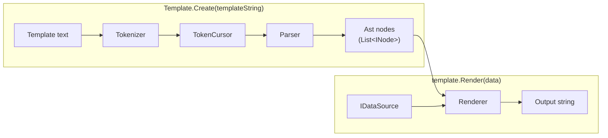
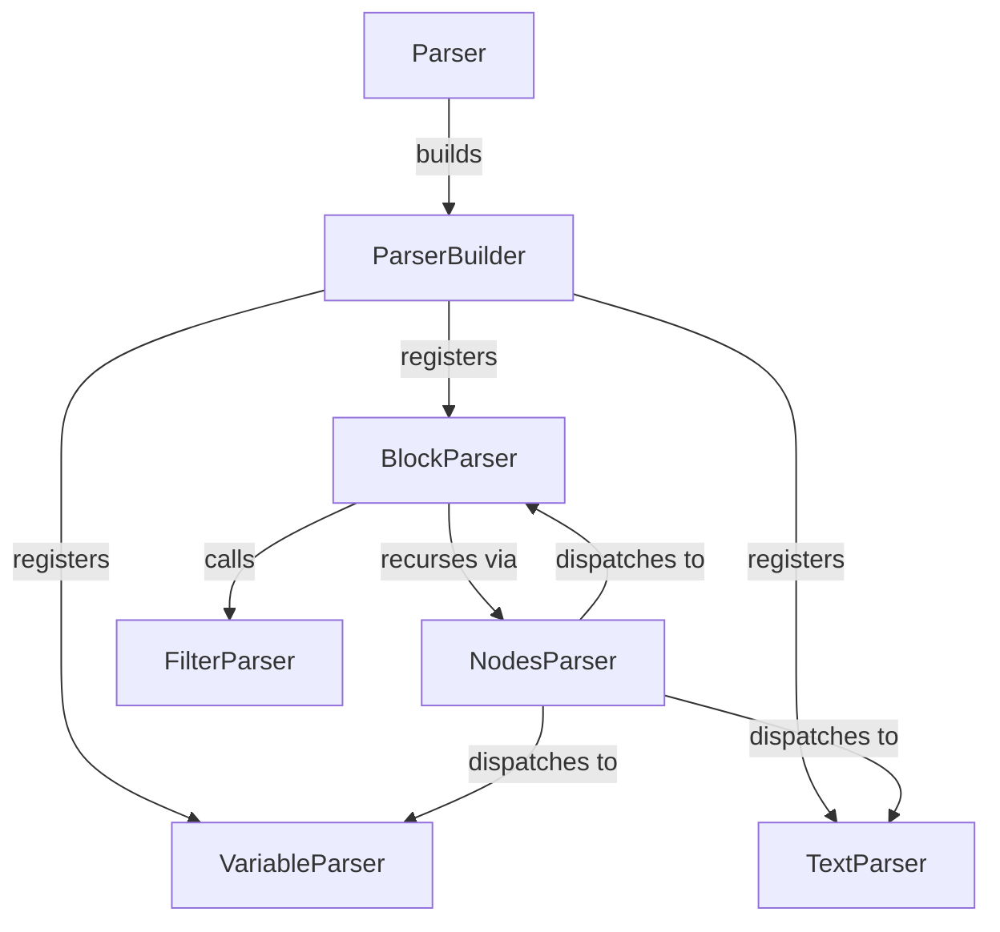
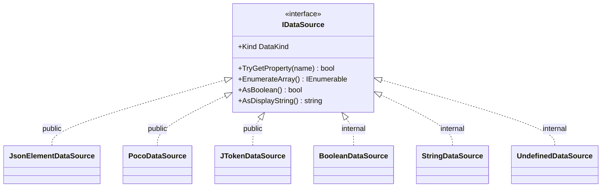

# Architecture

This describes how the engine is built today.

For the full syntax and behavior spec, see [specs.md](specs.md).

## The pipeline, in one picture

A template string becomes a `Template`. A `Template` plus some data becomes
output.



Two calls, two jobs:

- **`Template.Create(text)`** tokenizes and parses once. It hands back a
  `Template` — just the parsed AST, nothing render-specific yet.
- **`template.Render(data)`** walks that AST against some data and produces a
  string. Call it as many times as you want, with different data each time. The
  `Template` itself never changes.

## Tokenization

Turns raw template text into a flat list of tokens (`OpenToken`,
`CloseBlockToken`, `LiteralToken`, ...).

- **`SymbolTree`** is a trie of the special characters (`«`, `»`, `~`, `:`, `!`,
  `=`). It matches the *longest* run it can, then backtracks if that run turns
  out invalid. This is how `«` vs `««` vs `«««` (block depth) falls out for free
  — the trie just loops on itself for repeated characters.
- **`Tokenizer`** does a single pass over the text. It doesn't know what the
  symbols mean — it just asks `SymbolTree` "how far does a token extend from
  here?" and advances.
- **`TokenCursor`** holds the token list and a read position for the parser.
  It's the only place a `LiteralToken` gets trimmed in place.

## Parsing

Recursive-descent, one small parser class per node kind — no giant `switch` in a
single `Parser` class.



- **`Parser`** is the composition root. It builds a `ParserBuilder`, registers
  one concrete parser per token type, then drives the top-level loop itself.
- **`ParserBuilder`** just accumulates `Register<TToken>(factory)` calls and
  builds everything at the end. Deferring construction this way is what breaks a
  circular dependency: `NodesParser` needs the concrete parsers to dispatch to,
  and `BlockParser` needs `NodesParser` back, to parse a block's body.
- **`NodesParser`** is the dispatcher. Given a token, it looks up which concrete
  parser handles that token's type and calls it.
- **`VariableParser`**, **`TextParser`**, **`BlockParser`** each handle one node
  kind. `BlockParser` is the interesting one: it checks that a block's closing
  `»»` run has the same depth as its opening `««`, and it splits `name = expr`
  headers into a captured variable name plus a condition.
- **`FilterParser`** is a real `IParser`: its `Parse` parses one
  `(name = value)` group into a `FilterNode`, throwing if what follows `(`
  isn't a clean `name = value)`. `«`/`»` got their own reserved symbols from
  day one, and `(`/`)` now do too (`OpenParenToken`/`CloseParenToken`), rather
  than this being string-matched out of already-parsed text. Nothing
  dispatches to it through `NodesParser`, though — `(` is otherwise just
  literal, and templates use it in ordinary prose constantly, so treating
  every `(` as the start of a filter would break plain parenthetical text.
  `FilterParser.TryParse` is the form `BlockParser` actually calls: same
  parse, but it fails cleanly (`TokenCursor` rewinds) instead of throwing
  when `(` turns out to be ordinary text.
  `BlockParser` uses it for the one `(name = value)` position that exists
  today: a `(separator = ...)` line that is the *only* content on the line
  immediately before a block's own `»»` — nothing may precede the `(` on that
  line either, so `Total (separator = , )»»` is rejected as a filter (and
  falls back to plain literal text), exactly like `(separator = , ) more»»`
  would be. Since that line can land in either branch (the truthy body when
  there's no `~`, the falsy body when there is one — `~` itself always stays
  on its own line, never adjacent to the separator), `BlockParser` tries this
  on whichever body is parsed last, speculatively:
  `NodesParser.ParseNodes(stopAtOpenParen: true)` stops at any `(`, and
  `BlockParser` either commits it as `BlockNode.Separator` (found `separator`,
  at the start of its line, immediately followed by `»»`) or rewinds and
  treats that one `(` as literal before resuming — so a stray `(` in ordinary
  body text (`(head office)`) still renders as-is.

## Ast & rendering

Once parsed, the template is a tree of `INode`s that know how to render
themselves against a `Scope`.

- **`Scope`** wraps the current `IDataSource` plus a link to its parent scope.
  This parent link is how a property lookup falls back to an enclosing scope,
  and how `«first»`/`«last»` reach back to the nearest enclosing loop.
- **`BlockNode`** looks at what a block's header resolves to and picks a
  behavior: a list → `LoopBehavior`, an object → `ScopeBehavior`, anything else
  → `ConditionalBehavior`. Same syntax, behavior chosen by the resolved
  `DataKind`. A parsed `(separator = ...)` footer rides along as
  `BlockNode.Separator` and is handed straight to `LoopBehavior`: with no
  separator it concatenates each iteration's render as before; with one, it
  renders each iteration separately, trims its trailing newline, and joins the
  results with the separator instead.
- **`PropertyResolver`** does the actual property lookup, including the
  "filtered items" case (`items: active` loops over items where `active` is
  true) and walking up parent scopes to find who owns a property.
- **`VariableStore`** backs `««name = ...»»` variable definitions. A captured
  value is just a rendered string, wrapped as a `StringDataSource` — no
  round-trip through JSON needed.

## Pluggable data sources

The `Ast` layer never talks to `JsonElement` or reflection directly. It only
knows about one small interface:

```csharp
namespace Guillemets.Data;

public interface IDataSource
{
    DataKind Kind { get; }   // Object, Array, String, Number, Boolean, Null, Undefined
    bool TryGetProperty(string name, out IDataSource value);
    IEnumerable<IDataSource> EnumerateArray();
    bool AsBoolean();
    string? AsDisplayString();
}
```

Anyone can implement this to plug in a new data format. Today there are three
built-in adapters, plus a few internal sentinel values, all in the one core
`Guillemets` package (see "Why it's shaped this way" below for why there's no
separate package per adapter):



- **`JsonElementDataSource`** (`Guillemets.Data.Json`) adapts
  `System.Text.Json.JsonElement`.
- **`PocoDataSource`** (`Guillemets.Data.Poco`) adapts any plain C# object via
  reflection. Property lookup is exact-case, same as the JSON side — no
  case-insensitive matching.
- **`JTokenDataSource`** (`Guillemets.Data.Newtonsoft`) adapts
  `Newtonsoft.Json.Linq.JToken`. Newtonsoft's `JTokenType` has more members than
  `DataKind` needs — `Date`/`Raw`/`Bytes`/`Guid`/`Uri`/ `TimeSpan` all map to
  `DataKind.String` (still displayable via `AsDisplayString()`), and the
  structural/rare kinds (`Constructor`/ `Property`/`Comment`/`None`) map to
  `DataKind.Undefined`.
- **`BooleanDataSource`**, **`StringDataSource`**, **`UndefinedDataSource`**
  (`Guillemets.Data.Primitives`) are internal sentinel values: negation results,
  magic-variable booleans, captured variable strings, "this property doesn't
  exist." Not adapters, so they stay internal even though `IDataSource` is
  public.

### Where the `Render` methods live

`Template` has one core method: `Render(IDataSource)`. It's public, but you'll
rarely call it directly — each adapter brings its own friendlier overload as an
extension method:

- `template.Render(jsonElement)`
- `template.Render(jToken)`
- `template.RenderObject(poco)`

`Render(JsonElement)` and `Render(JToken)` are just overloads — the parameter
types are concrete and don't overlap, so there's no ambiguity.
`RenderObject(object)` keeps a distinct name on purpose: `object` is broad
enough that folding it into the same `Render` overload set would make it unclear
which one a given call resolves to.

All three extension classes live in the plain `Guillemets` namespace, not nested
under `Guillemets.Data`. That's deliberate: C# already lets code in a nested
namespace see its parent namespace without an extra `using`. So
`Guillemets.Data.Json` can see `Template` for free — and by putting the
extension method in `Guillemets` too, any caller who already wrote
`using Guillemets;` gets `Render`/`RenderObject` for free as well. A future
adapter should do the same: adapter type in its own `Guillemets.Data.X`
namespace, extension method in the root `Guillemets` namespace — named `Render`
if its parameter is a concrete type, or something distinct if the parameter type
is broad enough to blur overload resolution (as with `object`).

`Renderer` (internal) holds the actual per-call state — it's built fresh inside
every `Render()` call, so one `Template` is safe to reuse across many renders,
even concurrently.

## Tests

- **`JsonElementDataSourceTests`** / **`PocoDataSourceTests`** /
  **`JTokenDataSourceTests`** unit-test `IDataSource` directly — no `Template`
  involved. `PocoDataSourceTests` covers arrays, `List<T>`, `HashSet<T>`,
  `Collection<T>`, and a lazy `IEnumerable<T>`, not just `List`.
- **`JsonIntegrationTests`** / **`PocoIntegrationTests`** /
  **`JTokenIntegrationTests`** are black-box: they go through
  `Template.Create(...).Render(...)`. Each has one test reading the full
  `specs/09-integration/001-customer-offer` fixture. All three are currently
  `[Ignore]`d — confirmed genuinely failing today, waiting on the `tables` and
  `filters` milestones.
- **`SpecsRoot`** is a shared helper for finding `/specs` on disk, used by all
  of the above plus `SpecTests`.
- `/specs` itself stays the one JSON-based contract, run through `SpecTests`.
  The other adapters get a small targeted suite instead of running the whole
  corpus three times.
- All three adapters' tests live in the single `Guillemets.Tests` project — no
  per-adapter test project, matching the single-package decision below.

## Why it's shaped this way

- **`IDataSource`, not `IDataNode`.** `Node` would clash with `Ast`'s own
  `INode` tree.
- **One package, not one per adapter.** `PocoDataSource` only needs
  `System.Reflection`; `JTokenDataSource` needs `Newtonsoft.Json`. Neither is a
  heavy enough dependency to justify a separate package — simpler for consumers
  to install one package and call `Render`/ `RenderObject` with whatever data
  they already have, rather than picking the right NuGet package first.
- **Exact-case property matching**, matching how the JSON side already works. No
  case-insensitive or attribute-based remapping.
- **No typed accessors yet** (no `AsDateTime()`, `AsDecimal()`). `filters`
  (`date`/`currency`/`length`) will need real typed values, not just display
  strings — but that shape isn't decided yet. It'll be designed test-first, once
  that milestone actually starts. Guessing at it now would risk designing it
  twice.
