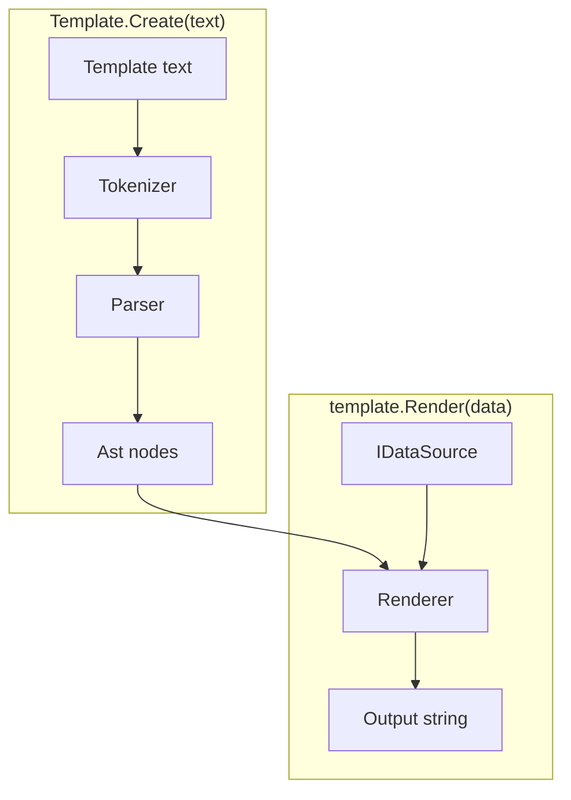
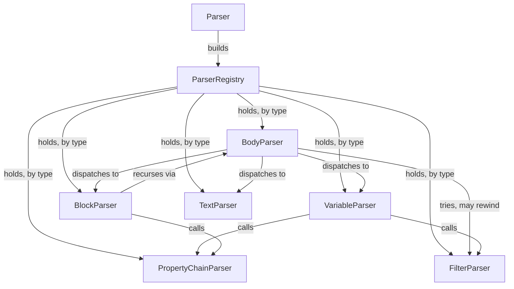

# Architecture

This describes how the engine is built, at a high level. For exact signatures
and algorithms, read the code. For behavior, see [specs.md](specs.md).

## The pipeline

A template string becomes a `Template`. A `Template` plus some data becomes
output.

`Template.Create` tokenizes and parses once. What comes back is a parsed tree
with nothing render-specific in it. `template.Render(data)` walks that tree
against some data and produces a string. Call it as often as you like, with
different data each time. The `Template` itself never changes.

The rest of this document follows that pipeline, one namespace at a time:
`Tokenization` → `Parsing` → `Ast` → `Rendering`. `Data` and `Filters` come
last; they are the two extension points `Rendering` calls out to.

## Tokenization

Turns raw text into a flat list of tokens. It has no idea what any of it means.
That is every later stage's job.

Symbols are declared once and matched by a trie, longest match wins; the
concrete table lives in [symbols.md](symbols.md). `Tokenizer` only asks the tree
how far a match extends and moves past it. Anything the tree doesn't recognize
piles up as plain text.

Every kind shares one `Token` shape, with no type hierarchy.

## Parsing

Recursive-descent, one small class per kind of node.

`ParserRegistry` has no opinion on what a "parser" is. Each class exposes
whatever shape fits it, instead of being forced through one common interface.
Collaborators that need each other are wired lazily, so registration order is
never a hazard.

Parsing walks the token list in sequence; nothing reaches back into the template
string.

## Ast

The parsed tree. Plain data, with no behavior beyond rendering dispatch.

`IRenderable` is the one interface `Renderer` walks. A few node types are data
only and never render themselves; `Rendering` resolves or applies those instead.
`TableBody` is a third shape — a view over a block's body that regroups it into
`TableRow`s and `TableCell`s, rendered directly by the behavior that owns them
rather than by walking.

## Rendering

Walks the `Ast` against a `Scope` and produces the output string. A `Scope` is
the current data plus a link to its parent, which is what makes property
fallback and loop-relative magic variables work.

`BlockNode` resolves its header to one of three behaviors, all implementing
`IBlockBehavior`:

| Resolved type | Behavior              |
|---------------|-----------------------|
| list          | `LoopBehavior`        |
| object        | `ScopeBehavior`       |
| anything else | `ConditionalBehavior` |

Same syntax every time, no keywords: only the resolved type decides. A property
chain resolves against the `Scope` chain, one chain at a time.

### Name resolution

`Glossary` turns a property-chain segment, written as natural words, into the
model's real property name. It wraps whatever `IStringLocalizer` the caller set
on `ParseOptions.Localizer`, and routes both the lookup and its fallback through
one replaceable conversion function, so a model that isn't PascalCase or
camelCase needs no other change.

Built glossaries are cached weakly, keyed by the localizer instance, so a scoped
or transient localizer can still be collected rather than pinning every glossary
ever built.

## Data

Adapts external data formats behind one small interface, so the rest of the
engine never touches a concrete format.

`IDataSource` is the one interface `Rendering` talks to for external data. It
covers object/array/scalar shape, property lookup, boolean coercion and the
display string.

JSON, POCO and Newtonsoft `JToken` are the three built-in adapters. All three
ship in the one core package rather than as separate per-format packages. Anyone
can add another by implementing the same interface.

## Filters

The pluggable value-transform pipeline stages behind `«expr / filter: arg»` and
the block-footer join.

`IFilter` is the one interface behind a pipeline stage: a sequence-in,
sequence-out transform. `Template.Create`'s optional `Action<ParseOptions>`
callback exposes `ParseOptions.Filters`, for registering your own alongside the
built-ins, and `ParseOptions.Localizer`. Both configure in one place.

A stage's default argument may depend on where it is written — inline, or in a
block footer — so a `FilterContext` travels with the pipeline.

## Tests

The `/specs` fixture corpus is the main acceptance suite. `SpecTests` runs it
once, against JSON data. Every other data-source adapter gets a smaller,
targeted suite instead of re-running the whole corpus.
