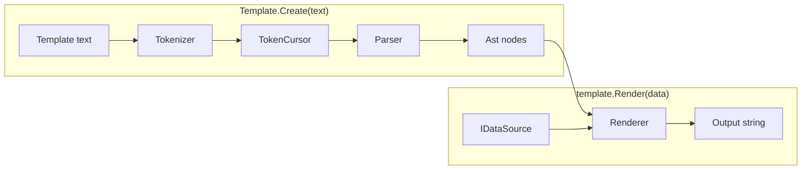
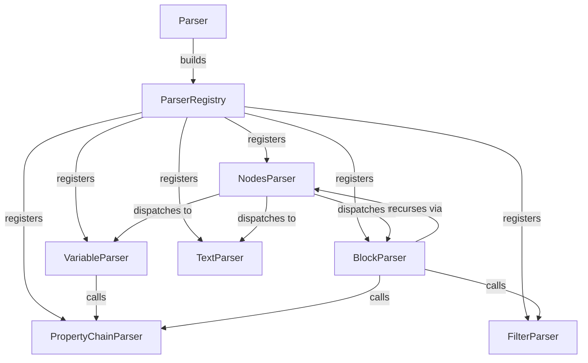
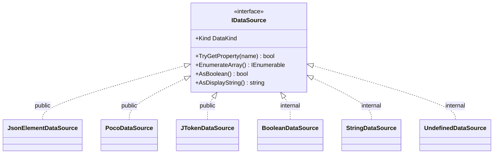

# Architecture

This describes how the engine is built today.

For the full syntax and behavior spec, see [specs.md](specs.md).

## The pipeline, in one picture

A template string becomes a `Template`. A `Template` plus some data becomes
output.



`Template.Create(text)` tokenizes and parses once, giving back a `Template` —
just the parsed tree, nothing render-specific yet. `template.Render(data)`
walks that tree against some data and produces a string. You can call
`Render` as many times as you like, with different data each time; the
`Template` itself never changes.

## Tokenization

The tokenizer turns raw template text into a flat list of tokens: `OpenToken`,
`CloseBlockToken`, `LiteralToken`, and so on.

`SymbolTree` is a trie of the special characters (`«`, `»`, `~`, `:`, `!`,
`=`, `(`, `)`, and the newline itself). It always matches the longest run it
can, backtracking if that run turns out invalid — this is how `«` vs. `««`
vs. `«««` (block depth) falls out for free, without any special-casing.

`Tokenizer` makes one pass over the text. It doesn't know what the symbols
mean; it just asks `SymbolTree` how far the next token extends and moves on.
Every `\n` becomes its own `NewlineToken`, so a `LiteralToken` never spans
more than one line — line-aware parsers (like `PropertyChainParser` below)
can just check for a `NewlineToken` instead of scanning literal text for an
embedded `\n`. The one exception is `»»`/`~`: those still swallow their own
trailing newline into their own token's text (`SymbolTree`'s `newline: true`
flag), the same as before this changed.

`TokenCursor` holds the resulting token list plus a read position for the
parser to walk.

## Parsing

Parsing is recursive-descent, with one small parser class per kind of node —
no single giant `switch` doing all the work.



`Parser` is the composition root: it builds a `ParserRegistry` — a
`Type → IParser` lookup — registering one concrete parser per token type,
then drives the top-level loop by resolving each token against that
registry. `NodesParser` is the dispatcher used everywhere else (inside a
block, or recursively): given a token, it asks the registry to resolve a
handler and calls it. `VariableParser`, `TextParser`, and `BlockParser` each
handle one node kind; `BlockParser` is the interesting one, since it also
checks that a block's closing `»»` matches its opening depth.

Two collaborators are registered the same way but are never reached through
token dispatch — they're only ever fetched by their own type, via
`ParserRegistry.Get<T>()`:

- `PropertyChainParser` parses a `«...»`/`««...»` property chain. The
  mechanics are shared — walk `NegationToken`/`LiteralToken`, with an
  optional `EqualsToken`-triggered capture of a `name = expr` variable
  definition — but where the chain *stops* differs: `VariableParser` stops
  at a `CloseToken`; `BlockParser` stops at a `NewlineToken`, since a block
  header always ends at end-of-line.
- `FilterParser` parses `(name = value)` groups, such as `(separator = , )`,
  into a `FilterNode`. It isn't wired into the normal dispatch table either,
  because `(` is ordinary text almost everywhere in a template — instead,
  `BlockParser` asks it to try parsing a filter only in the one place one can
  legally appear: a line of its own, right before a block's closing `»»`. If
  that doesn't pan out, the `(` is treated as plain text instead.

## Ast & rendering

Once parsed, the template is a tree of `INode`s that render themselves
against a `Scope`.

`Scope` wraps the current `IDataSource` plus a link to its parent scope.
That parent link is how a property lookup falls back to an enclosing scope,
and how `«first»`/`«last»` reach back to the nearest enclosing loop.

`BlockNode` looks at what a block's header resolves to and picks a
behavior: a list becomes a `LoopBehavior`, an object a `ScopeBehavior`,
anything else a `ConditionalBehavior`. Same syntax every time — only the
resolved type decides. An optional `(separator = ...)` footer rides along
and is handed to `LoopBehavior`, which then joins each iteration with that
separator instead of concatenating them.

`PropertyResolver` does the actual property lookup: walking up parent scopes
to find who owns a property, and handling the "filtered items" case where
`items: active` loops over only the items whose `active` is true.

`VariableStore` backs `««name = ...»»` definitions. A captured value is just
the rendered string, wrapped as a `StringDataSource` — no round-trip through
JSON needed.

## Pluggable data sources

The Ast layer never talks to `JsonElement` or reflection directly. It only
knows about one small interface:

```csharp
public interface IDataSource
{
    DataKind Kind { get; }   // Object, Array, String, Number, Boolean, Null, Undefined
    bool TryGetProperty(string name, out IDataSource value);
    IEnumerable<IDataSource> EnumerateArray();
    bool AsBoolean();
    string? AsDisplayString();

    IDataSource Negate() => AsBoolean() ? BooleanDataSource.FALSE : BooleanDataSource.TRUE;
}
```

`Negate` is a default interface method — it's fully derived from
`AsBoolean()`, so none of the adapters need to implement it themselves.

Anyone can implement this to plug in a new data format. Today there are
three built-in adapters, plus a few internal sentinel values, all shipped in
the one `Guillemets` package:



`JsonElementDataSource` adapts `System.Text.Json.JsonElement`.
`PocoDataSource` adapts any plain C# object via reflection, exact-case, the
same as the JSON side. `JTokenDataSource` adapts
`Newtonsoft.Json.Linq.JToken` — the handful of `JTokenType` kinds that
`DataKind` has no equivalent for collapse into `String` (still displayable)
or `Undefined` (structural/rare tokens like comments).

`BooleanDataSource`, `StringDataSource`, and `UndefinedDataSource` are
internal sentinel values used inside the engine itself — negation results,
magic loop variables, captured variable strings, "this property doesn't
exist." They aren't adapters, so unlike the three above they stay internal.

Each adapter also brings a friendlier way to call `Render`, as an extension
method on `Template`: `template.Render(jsonElement)`,
`template.Render(jToken)`, `template.RenderObject(poco)`. These live
alongside their adapter's data source but sit in the plain `Guillemets`
namespace, so anyone who already has `using Guillemets;` gets them for free.

The actual rendering work happens in `Renderer`, which is built fresh for
every call to `Render` — so a single `Template` is safe to reuse across many
renders, even concurrently.

## Pluggable filters

Filters follow the same shape as data sources: one small interface, and
callers pass instances in from outside rather than the engine hard-coding
them.

```csharp
public interface IFilter
{
    string Apply(IReadOnlyList<string> values, IReadOnlyList<string> args);
}
```

`FilterRegistry` maps a name to an `IFilter`. `Template.Create` builds it
with the one built-in — `"separator"` → `SeparatorFilter` — then hands it
to an optional `Action<FilterRegistry>` callback, so a caller can add more
without ever constructing or holding the registry itself:

```csharp
var template = Template.Create(text,
    filters => filters.Register("upper", new UpperFilter())
);
```

`SeparatorFilter` does the actual joining behind `(separator = ...)`, both
the inline form and the loop-block footer. It stays `internal` — callers
only ever reach it by the name `"separator"`, never by type. That also means
the loop-block footer position specifically requires the real
`SeparatorFilter` type, not just a filter registered under that name — a
custom filter has no template-syntax hook to be invoked from yet, since the
only place `(name = value)` is recognized today is that one footer position.

## Tests

`JsonElementDataSourceTests`, `PocoDataSourceTests`, and
`JTokenDataSourceTests` unit-test each `IDataSource` adapter directly,
without going through `Template` at all. `JsonIntegrationTests`,
`PocoIntegrationTests`, and `JTokenIntegrationTests` are black-box instead,
going through `Template.Create(...).Render(...)`.

The `/specs` fixture corpus itself is the main acceptance suite, run once
through `SpecTests` against JSON data — the other two adapters get a small
targeted suite each rather than re-running the whole corpus three times.
