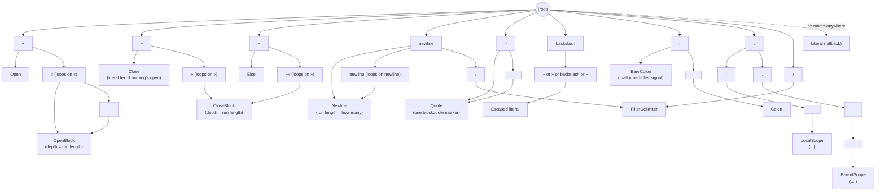

# Symbols

The concrete symbol table `Tokenization` recognizes. For the shape of the engine
see [architecture.md](architecture.md); for what these symbols *mean* to a
template author see [specs.md](specs.md).

Symbols are declared once, in `Symbols.cs`. Each character walks one level
deeper into the trie, and a node with a `TokenKind` attached is a match. Longest
match wins, so depth (`«`, `««`, `«««`, ...) and the scope-navigation markers
(`.: `, `..: `) cost nothing extra — they share prefixes with shorter symbols.
Adding a symbol or a repeating run is one line there and nothing else in the
tokenizer changes.

A kind whose special meaning doesn't apply in context falls back to plain
literal text, so the tokenizer never has to understand context. One `Quote`
token is one marker, whatever the spacing, which is what makes a line's
blockquote depth a count of consecutive `Quote` tokens rather than a character
scan.
